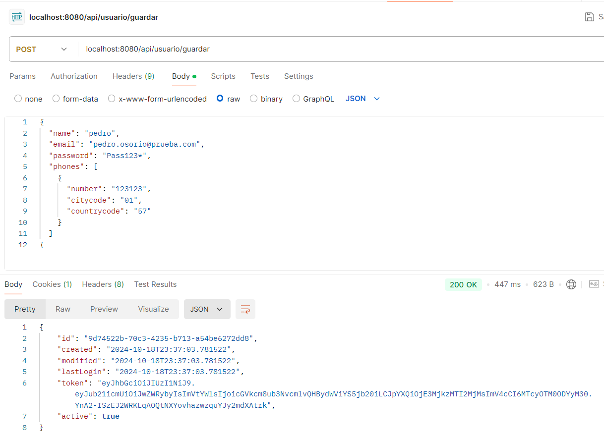
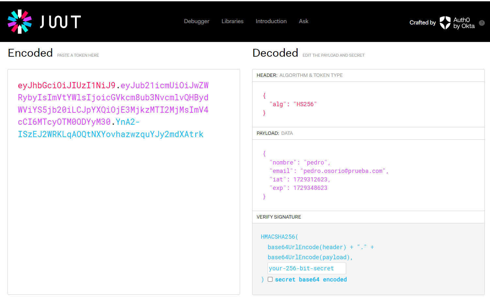
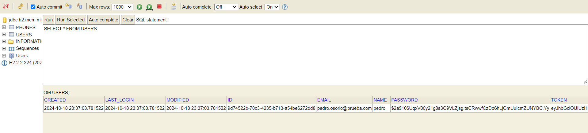
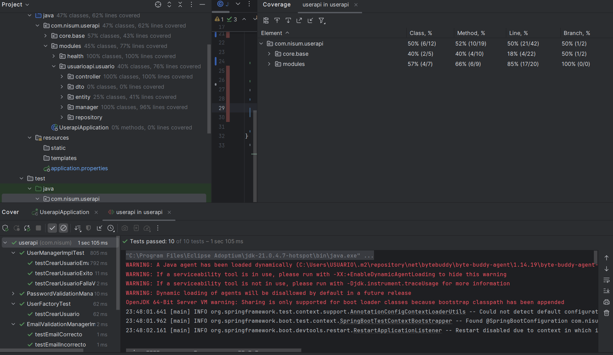
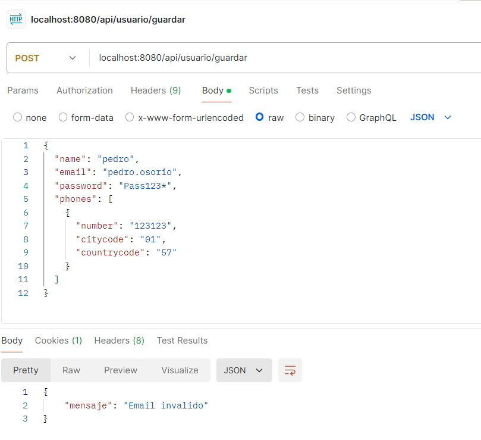
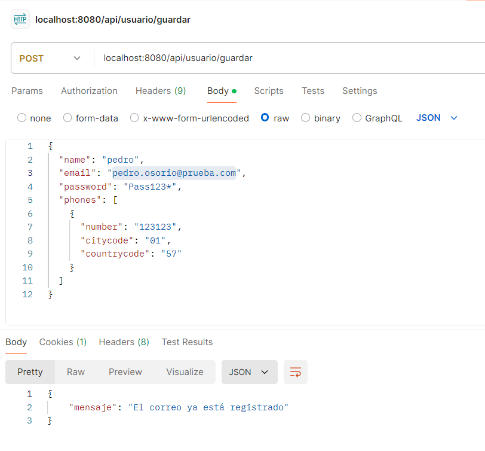
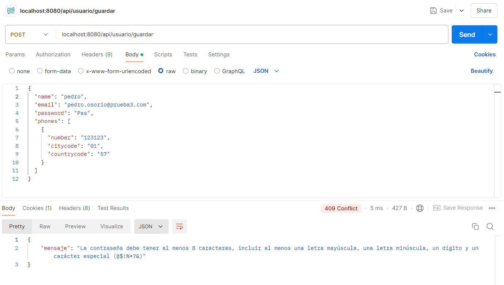

# Instrucciones para Ejecutar el Proyecto

A continuación se detallan los pasos para clonar el proyecto y ejecutarlo en tu máquina local.

## Requisitos Previos

Asegúrate de tener instalados los siguientes programas en tu sistema:

- **Git**: [Instrucciones de instalación](https://git-scm.com/book/en/v2/Getting-Started-Installing-Git)
- **Java 21 OpenJDK**: [Descargar JDK](https://adoptium.net/es/)
- **Maven**: [Instrucciones de instalación](https://maven.apache.org/install.html)

## Pasos para Clonar y Ejecutar el Proyecto

1. **Clona el repositorio**:
   ```bash
   git clone https://github.com/PedroOsorioCode/userapi.git
   ```
2. **Abrir consola CMD e Ir a la carpeta donde se clonó el repositorio**:
   ```bash
   cd to_directorio
   ```
3. **ejecutar**:
   ```bash
   mvn clean install
   mvn spring-boot:run
   ```
5. **Acceder a las url**:
 - [Swagger](http://localhost:8080/swagger-ui/index.html#/usuario-controller/registrarUsuario)
 - [H2-database](http://localhost:8080/h2-console)

### Ejemplos
- 
- 
- 
- 

### Validaciones
- 
- 
- 
