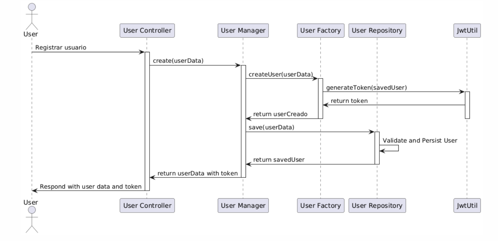
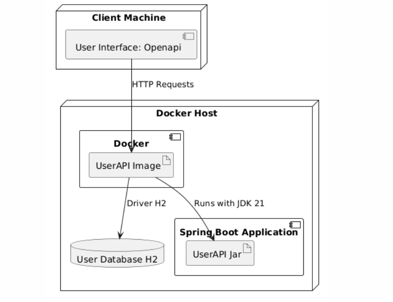
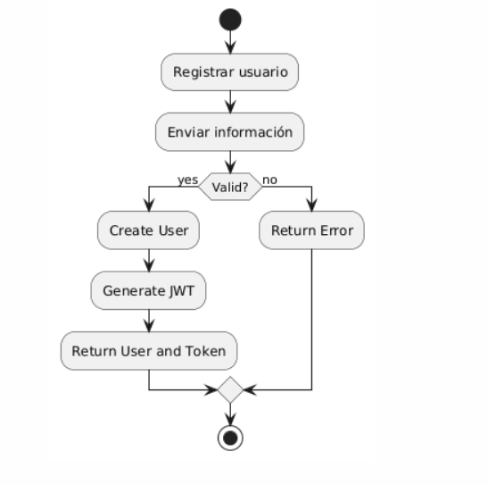
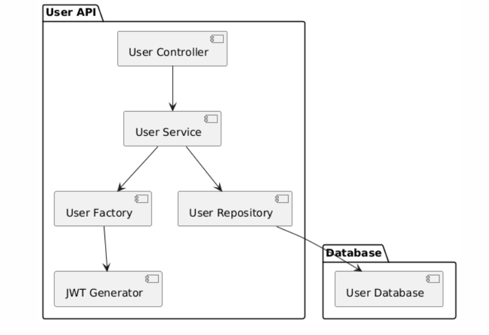

# User API

> Este repositorio contiene una versión de api rest para la creación de usuarios

## Características
1. Arquitectura limpia
2. Aplicación de patrones
    - Factory
    - Builder
    - Singleton
    - Principios SOLID
3. Generación token JWT
4. Contraseña validada por expresión regular y almacenada de forma encriptada
5. Base de datos H2
6. Aplicación sonarlint
7. Cobertura de código
8. Swagger

## Formas de validar la aplicación.

1. Despliegue local usando Maven [Ver pasos](README-Maven.md)
2. Despliegue local usando Docker [Ver pasos](README-DOCKER.md)

## Diagramas de la solución

Para mayor información sobre la creación de estos diagramas visita el siguiente link [Ver detalle](README-UML.md)

### **Secuencia**

### **Despliegue en Docker**

### **Actividades**

### **Componentes**

---

**Author**: Pedro Luis Osorio Pavas [Linkedin](www.linkedin.com/in/pedro-luis-osorio-pavas-68b3a7106)
**Start Date**: 17-10-2024
**Update Date**: 19-10-2024